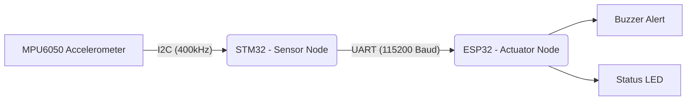

# 🏎️ Distributed Automotive Airbag ECU Simulation
**A Multi-Processor Crash Detection & Actuation System (STM32 + ESP32)**

## 📌 Project Executive Summary
This project implements a **Distributed Electronic Control Unit (ECU)** architecture simulating a vehicle's Supplemental Restraint System (SRS). By decoupling the sensing logic (STM32) from the actuation logic (ESP32), the system mimics professional automotive design patterns, emphasizing **real-time signal processing**, **inter-processor communication (IPC)**, and **deterministic fail-safe triggers**.

---

## 🧠 System Architecture & Engineering Design

The system is split into two specialized nodes to ensure high-speed sensor polling without blocking the actuation feedback loop.

### 1. The Sensor Node (STM32F103)
   The "Brain" of the system. It handles high-frequency data acquisition from the MPU6050 via I2C.

   - Vector Magnitude Calculation: To remain orientation-independent, the ECU calculates the Euclidean Norm ($A_{total}$) of the 3-axis accelerometer data:

  $$A_{total} = \sqrt{A_x^2 + A_y^2 + A_z^2}$$

  - Threshold Trigger: Implements a detection algorithm that filters out minor vibrations, triggering only when $G$-force exceeds a predefined safety threshold (e.g., $2.0g$).
### 2. The Actuator Node (ESP32)
The "Safety Node." It operates as a dedicated listener via UART (115200 Baud).
- Asynchronous Processing: Uses Hardware Serial interrupts/buffers to ensure no deployment signals are missed while the CPU is managing the alert state.
-  Multi-Modal Alert: Simulates airbag deployment through synchronized visual (LED) and audible (Buzzer) indicators.
  
  ---
## 🛠️ Tech Stack & Hardware
- Microcontrollers: STM32F103C8T6 (ARM Cortex-M3), ESP32 DevKit V1 (Xtensa Dual-Core).
- Development Environments: STM32CubeIDE (HAL/C), Arduino IDE (C++).
- Protocols: I2C (Sensor communication), UART (Inter-MCU communication).
- Key Concepts: Signal processing, Interrupt handling, Distributed systems, Embedded C.
  
  ---
 ## 🔌 Interface Definition
| Interface       | Protocol | Configuration | Purpose              |
| --------------- | -------- | ------------- | -------------------- |
| MPU6050 ↔ STM32 | I2C      | 400 kHz       | Motion sensing       |
| STM32 ↔ ESP32   | UART     | 115200, 8N1   | Trigger transmission |

  ---
  ## 📍 Pin Mapping
  ##### MPU6050 → STM32
 
   -VCC → 3.3V
   
   -GND → GND
   
   -SCL → PB6
   
   -SDA → PB7
   
   ##### STM32 → ESP32

-PA9 (TX) → GPIO16 (RX)

##### ESP32 Outputs

-LED → GPIO2

-Buzzer → GPIO4

